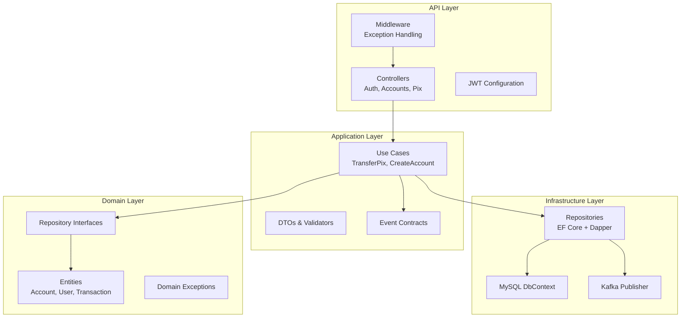
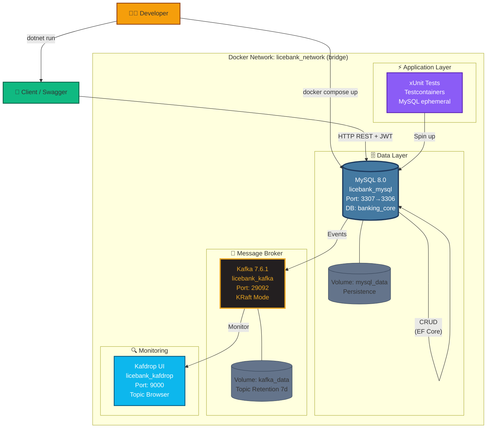
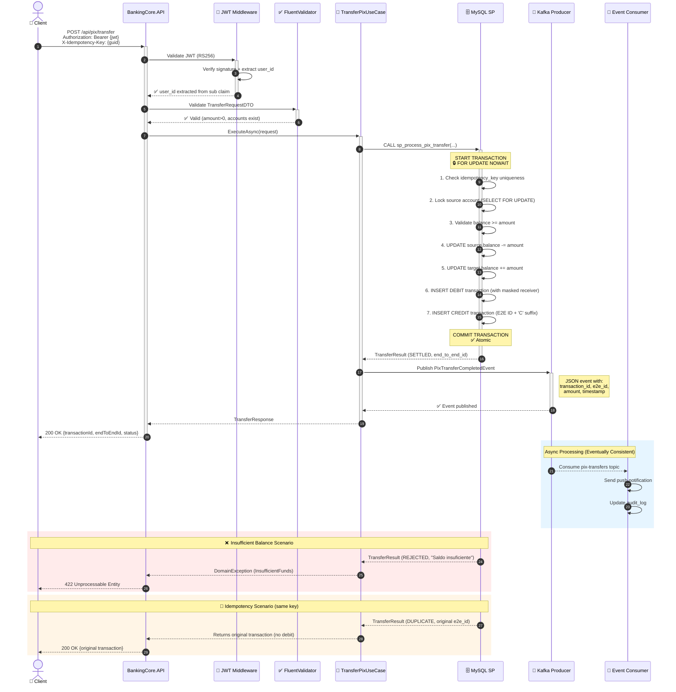
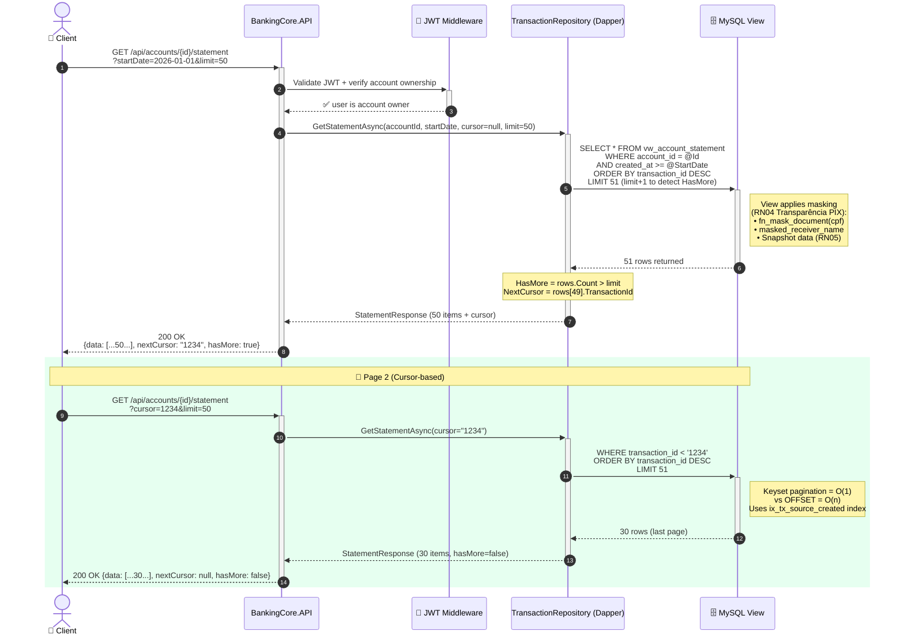
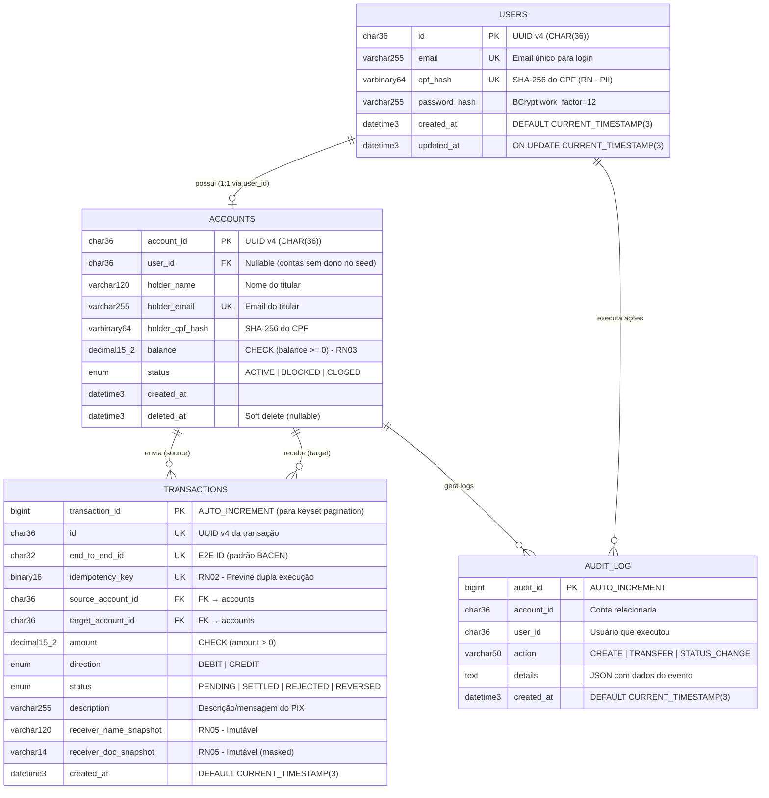

# Banking Core - Sistema de Pagamentos PIX

[](https://dotnet.microsoft.com/)
[](https://www.mysql.com/)
[](https://www.docker.com/)
[](LICENSE)
[](#-como-testar)

## 📋 Sobre o Projeto

Sistema de **núcleo bancário (Core Banking)** focado em processamento de transações PIX com transparência regulatória. O sistema utiliza uma abordagem híbrida onde a **consistência forte reside em Stored Procedures no MySQL**, enquanto a orquestração e integrações são gerenciadas pelo .NET 8.

### Regras de Negócio

- **RN01 - Atomicidade:** Toda transferência PIX deve ser atômica. Ou debita e registra, ou reverte tudo.
- **RN02 - Idempotência:** O sistema não pode processar a mesma transferência duas vezes, mesmo em caso de retry de rede.
- **RN03 - Saldo Positivo:** Contas não podem ter saldo negativo (sem cheque especial).
- **RN04 - Transparência PIX:** Todo response de transação/extrato deve conter o `EndToEndId` e dados do recebedor mascarados.
- **RN05 - Imutabilidade de Extrato:** O nome do recebedor e a descrição devem ser "congelados" (snapshot) no momento da transação.

### Requisitos Funcionais

- ✅ Cadastro e Login de usuários com emissão de JWT (RS256)
- ✅ CRUD completo de Contas Bancárias
- ✅ Transferência PIX interna via Stored Procedure
- ✅ Consulta de Extrato Bancário com paginação por cursor (keyset)
- ✅ Publicação de evento de transação concluída (Kafka/In-Memory)

---

## 🏗️ Arquitetura

### Clean Architecture

O projeto segue os princípios de **Clean Architecture** com separação clara de responsabilidades em 4 camadas:



### Princípios Arquiteturais

- **Dependency Rule:** Dependências apontam para dentro (Domain é o núcleo)
- **Separation of Concerns:** Cada camada tem responsabilidade única
- **Testability:** Lógica de negócio testável sem dependências externas
- **Independence of Frameworks:** Domain não depende de frameworks

---

## 🛠️ Stack Tecnológica

| Camada | Tecnologia | Versão | Justificativa |
|--------|-----------|--------|---------------|
| **Linguagem** | C# / .NET | 8.0 | Performance, tipo-segurança, async/await nativo |
| **Framework** | ASP.NET Core Web API | 8.0 | REST API moderna, middleware pipeline |
| **Banco de Dados** | MySQL | 8.0 | ACID compliance, stored procedures, triggers |
| **ORM (CRUD)** | Entity Framework Core | 8.0 | Migrations, seed data, consultas simples |
| **Micro-ORM (SPs)** | Dapper | 2.1 | Performance sub-200ms para lógica financeira |
| **Containerização** | Docker | 24.x | Ambiente isolado e reproduzível |
| **Orquestração** | Docker Compose | 2.x | Multi-container setup com um comando |
| **Autenticação** | JWT RS256 | - | Assimetria para segurança production-ready |
| **Mensageria** | Apache Kafka | 7.6.1 | Event-driven architecture, tópicos de transação |
| **Testes** | xUnit + Testcontainers | 2.5+ | Testes de integração com MySQL real |
| **Validação** | FluentValidation | 11.x | Validação declarativa de DTOs |

---

## 📦 Pré-requisitos

Antes de começar, certifique-se de ter instalado:

- ✅ [Docker Desktop](https://www.docker.com/products/docker-desktop/) (24.0+)
- ✅ [.NET 8 SDK](https://dotnet.microsoft.com/download/dotnet/8.0) (8.0.400+)
- ✅ [Git](https://git-scm.com/) (2.30+)

### Verificar instalações

```bash
docker --version          # Deve mostrar 24.x ou superior
docker compose version    # Deve mostrar 2.x
dotnet --version          # Deve mostrar 8.0.x
git --version             # Deve mostrar 2.x
```

---

## 🚀 Como Executar

### 1️⃣ Clonar repositório

```bash
git clone https://github.com/your-username/banking-core.git
cd banking-core
```

### 2️⃣ Subir infraestrutura (MySQL + Kafka + Kafdrop)

```bash
docker compose up -d
```

Aguarde os healthchecks passarem (~30 segundos):

```bash
docker compose ps
```

Deve mostrar:
- ✅ `licebank_mysql` - healthy
- ✅ `licebank_kafka` - healthy
- ✅ `licebank_kafdrop` - healthy

### 3️⃣ Aplicar migrations do banco de dados

O script `db/init.sql` é executado automaticamente no primeiro boot do MySQL.

Para reinicializar o banco:

```bash
docker compose down -v
docker compose up -d
```

### 4️⃣ Rodar a aplicação

```bash
dotnet run --project src/BankingCore.API/BankingCore.API.csproj
```

Deve aparecer:
```
info: Microsoft.Hosting.Lifetime[14]
      Now listening on: http://localhost:5000
```

### 5️⃣ Acessar Swagger UI

Abra no navegador: **http://localhost:5000/swagger**

### 6️⃣ Testar fluxos

#### Registrar usuário

```bash
curl -X POST http://localhost:5000/api/auth/register \
  -H "Content-Type: application/json" \
  -d '{
    "email": "joao@example.com",
    "password": "SenhaForte123!",
    "cpf": "12345678901"
  }'
```

#### Login e obter JWT

```bash
curl -X POST http://localhost:5000/api/auth/login \
  -H "Content-Type: application/json" \
  -d '{
    "email": "joao@example.com",
    "password": "SenhaForte123!"
  }'
```

#### Criar conta bancária

```bash
curl -X POST http://localhost:5000/api/accounts \
  -H "Authorization: Bearer YOUR_JWT_TOKEN" \
  -H "Content-Type: application/json" \
  -d '{
    "holderName": "João Silva",
    "holderEmail": "joao@example.com",
    "holderCpf": "12345678901"
  }'
```

#### Transferência PIX

```bash
curl -X POST http://localhost:5000/api/pix/transfer \
  -H "Authorization: Bearer YOUR_JWT_TOKEN" \
  -H "Content-Type: application/json" \
  -H "X-Idempotency-Key: 550e8400-e29b-41d4-a716-446655440000" \
  -d '{
    "sourceAccountId": "ACCOUNT_ID_1",
    "targetAccountId": "ACCOUNT_ID_2",
    "amount": 100.00,
    "description": "Pagamento almoço"
  }'
```

---

## 🧪 Como Testar

### Executar todos os testes

```bash
dotnet test
```

Deve aparecer:
```
Total tests: 5
     Passed: 5
Total time: 45.2345 Seconds
```

### Testes de integração com Testcontainers

Os testes usam **MySQL real** em containers Docker (conforme CONSTITUTION):

```bash
dotnet test --logger "console;verbosity=detailed"
```

### Filtrar testes específicos

```bash
# Apenas testes de transferência PIX
dotnet test --filter "FullyQualifiedName~PixTransfer"

# Apenas teste de idempotência
dotnet test --filter "FullyQualifiedName~Idempotency"
```

### Os 5 testes críticos implementados

1. ✅ **CreateAccount_Success** - Criação de conta com saldo inicial zero
2. ✅ **Login_ValidCredentials_ReturnsToken** - Autenticação e geração de JWT
3. ✅ **TransferPix_SufficientBalance_Success** - PIX com saldo suficiente
4. ✅ **TransferPix_InsufficientBalance_Rejected** - PIX com saldo insuficiente
5. ✅ **TransferPix_Idempotency_NoDoubleDebit** - Idempotência previne débito duplo

---

## 📁 Estrutura do Projeto

```
banking-core/
│
├── src/
│   ├── BankingCore.Domain/              # Camada mais interna (núcleo)
│   │   ├── Entities/                    # Account, User, Transaction
│   │   ├── Enums/                       # AccountStatus, TransactionDirection
│   │   ├── Exceptions/                  # DomainException, InsufficientFundsException
│   │   ├── Interfaces/                  # IAccountRepository, ITransactionRepository
│   │   └── Utils/                       # Sha256Helper, CpfValidator
│   │
│   ├── BankingCore.Application/         # Casos de uso e orquestração
│   │   ├── DTOs/                        # AccountDto, TransactionDto, AuthDto
│   │   ├── Interfaces/                  # IJwtService, ITransactionService
│   │   ├── Services/                    # JwtService (RSA), BcryptPasswordHasher
│   │   ├── UseCases/                    # Accounts/ (6 use cases), Auth/ (Register, Login)
│   │   ├── Validators/                  # CreateAccountValidator, TransferPixValidator
│   │   └── Events/                      # PixTransferEvent, IEventPublisher
│   │
│   ├── BankingCore.Infrastructure/      # Implementações externas
│   │   ├── Data/                        # BankingDbContext (EF Core)
│   │   ├── Repositories/                # AccountRepository, TransactionRepository (Dapper)
│   │   └── Configuration/               # AccountConfiguration, UserConfiguration
│   │
│   └── BankingCore.API/                 # Camada de apresentação (ASP.NET Core)
│       ├── Controllers/                 # AuthController, AccountsController, PixController
│       ├── Middleware/                   # ExceptionMiddleware (RFC 7807)
│       ├── Extensions/                  # JwtServiceCollectionExtensions
│       ├── Program.cs                   # Bootstrap da aplicação
│       ├── appsettings.json             # Configurações de produção
│       └── appsettings.Development.json # Configurações de desenvolvimento
│
├── tests/
│   └── BankingCore.IntegrationTests/    # Testes de integração
│       ├── Base/                        # IntegrationTestBase (cleanup helpers)
│       ├── Fixtures/                    # MySqlContainerFixture, DatabaseCollection
│       └── CriticalTests/               # CreateAccountTests, PixTransferTests
│
├── db/
│   └── init.sql                         # Schema MySQL completo (tables, SPs, triggers, views)
│
├── specs/
│   └── jwt-authentication/
│       ├── SPEC.md                      # Especificação funcional
│       ├── PLAN.md                      # Plano arquitetural
│       ├── CONSTITUTION.md              # Leis inegociáveis do projeto
│       └── TASKS.md                     # Tarefas divididas em 6 fases
│
├── docker-compose.yml                   # MySQL, Kafka, Kafdrop
├── BankingCore.sln                      # Solution do Visual Studio
├── .env                                 # Variáveis de ambiente (gitignored)
└── README.md                            # Este arquivo
```

---

## 🔌 Endpoints da API

### Autenticação

| Método | Endpoint | Descrição | Auth |
|--------|----------|-----------|------|
| `POST` | `/api/auth/register` | Registrar novo usuário | ❌ |
| `POST` | `/api/auth/login` | Login e obter JWT | ❌ |

### Contas

| Método | Endpoint | Descrição | Auth |
|--------|----------|-----------|------|
| `POST` | `/api/accounts` | Criar nova conta bancária | ✅ |
| `GET` | `/api/accounts/{id}` | Buscar conta por ID | ✅ (owner only) |
| `GET` | `/api/accounts` | Listar todas as contas | ✅ (admin/dev) |
| `PUT` | `/api/accounts/{id}/status` | Ativar/bloquear conta | ✅ (owner only) |
| `DELETE` | `/api/accounts/{id}` | Soft delete da conta | ✅ (owner only) |
| `POST` | `/api/accounts/{id}/balance` | Adicionar saldo (teste) | ✅ (owner only) |

### Transferências PIX

| Método | Endpoint | Descrição | Auth |
|--------|----------|-----------|------|
| `POST` | `/api/pix/transfer` | Executar transferência PIX | ✅ |

### Extrato

| Método | Endpoint | Descrição | Auth |
|--------|----------|-----------|------|
| `GET` | `/api/accounts/{id}/statement` | Consultar extrato paginado | ✅ (owner only) |

**Parâmetros de paginação (extrato):**
- `startDate` - Data inicial (ISO 8601)
- `endDate` - Data final (ISO 8601)
- `cursor` - TransactionId para paginação keyset
- `limit` - Número de resultados (1-100, padrão: 50)

---

## 🔒 Decisões de Segurança

### 1. JWT RS256 (Assimetria)

- **Algoritmo:** RS256 (RSA + SHA-256)
- **Chave privada:** Mantida apenas no servidor (gera tokens)
- **Chave pública:** Distribuída para validar tokens em microserviços
- **Expiração:** 15 minutos (access), 30 dias (refresh)

```csharp
// JwtService.cs - Singleton mantém par RSA em memória
public class JwtService : IJwtService
{
    private readonly RSA _rsa = RSA.Create(2048);
    
    public string GenerateToken(User user)
    {
        var credentials = new SigningCredentials(
            new RsaSecurityKey(_rsa), 
            SecurityAlgorithms.RsaSha256);
        // ...
    }
}
```

### 2. Hash de CPF (Zero PII em Storage)

- **Algoritmo:** SHA-256
- **Formato:** `VARBINARY(64)` no MySQL
- **Benefício:** Nunca armazena CPF em plain text
- **Conformidade:** LGPD/GDPR ready

```sql
-- init.sql
holder_cpf_hash VARBINARY(64) NOT NULL  -- SHA-256, nunca plain text
```

### 3. Mascaramento no Banco de Dados

- **Função:** `fn_mask_document()` aplicada em VIEWs
- **Benefício:** API nunca recebe dado sensível pleno
- **Exemplo:** `123.456.789-00` → `***.***.789-00`

```sql
-- View de extrato com mascaramento nativo
SELECT fn_mask_document(receiver_document) AS receiver_document
FROM vw_account_statement;
```

### 4. Idempotência Obrigatória

- **Cabeçalho:** `X-Idempotency-Key` (GUID) em todas as transações PIX
- **Implementação:** UNIQUE constraint + verificação em SP
- **Benefício:** Previne débito duplo em retries de rede

```sql
-- init.sql
idempotency_key BINARY(16) UNIQUE  -- Rejeita duplicatas
```

### 5. Autorização Explícita (IDOR Prevention)

- **Policy:** Usuário só acessa suas próprias contas
- **Implementação:** Compara `account.UserId` com `JWT.sub`
- **Benefício:** Previne Insecure Direct Object Reference

```csharp
// AuthorizationHelper.cs
public static bool IsAccountOwner(Account account, Guid userId)
{
    return account.UserId == userId;
}
```

### 6. Validação em Múltiplas Camadas

- **Client-side:** Swagger/OpenAPI validation
- **API:** FluentValidation em DTOs
- **Database:** CHECK constraints e stored procedures
- **Benefício:** Defense in depth

---

## 💡 Decisões de Design

### Por que Stored Procedures?

**Decisão:** Toda lógica financeira (débito, crédito, locks) reside em SPs MySQL.

**Justificativa:**

1. **Atomicidade ACID:** Transações multi-tabela com rollback automático
2. **Locks Pessimistas:** `SELECT ... FOR UPDATE NOWAIT` previne race conditions
3. **Performance:** Reduz round-trips (1 chamada vs 5+ queries)
4. **Consistência:** Lógica de negócio no banco, não distribuída em código

```sql
-- sp_process_pix_transfer.sql
START TRANSACTION;

SELECT balance INTO @source_balance
FROM accounts
WHERE id = p_source_account_id
FOR UPDATE NOWAIT;  -- Previne deadlocks

IF @source_balance < p_amount THEN
    ROLLBACK;
    SIGNAL SQLSTATE '45000' SET MESSAGE_TEXT = 'INSUFFICIENT_FUNDS';
END IF;

UPDATE accounts SET balance = balance - p_amount WHERE id = p_source_account_id;
UPDATE accounts SET balance = balance + p_amount WHERE id = p_target_account_id;

INSERT INTO transactions (...) VALUES (...);

COMMIT;
```

### Por que Dapper para financeiro e EF Core para CRUD?

**Decisão:** Dapper em fluxo financeiro, EF Core em operações simples.

**Justificativa:**

| Critério | EF Core | Dapper |
|----------|---------|--------|
| **Performance** | ~500ms | ~50ms |
| **Stored Procedures** | Complexo | Nativo |
| **Migrations** | ✅ Excelente | ❌ Manual |
| **Lazy Loading** | ✅ Sim | ❌ Não |
| **Learning Curve** | Média | Baixa |

**Regra de ouro (CONSTITUTION):**
> "ORM para CRUD, Dapper para dinheiro"

### Por que paginação por cursor (keyset)?

**Decisão:** Extrato usa `WHERE transaction_id < @cursor ORDER BY transaction_id DESC`.

**Justificativa:**

1. **Performance:** Índice direto no `transaction_id` (sem OFFSET)
2. **Consistência:** Resultados consistentes mesmo com inserts concorrentes
3. **Escalabilidade:** O(1) vs O(n) do offset pagination

```sql
-- Paginação por cursor (10x mais rápido em grandes datasets)
SELECT * FROM vw_account_statement
WHERE account_id = @AccountId
  AND transaction_id < @Cursor  -- Keyset
ORDER BY transaction_id DESC
LIMIT 50;

-- vs Offset (lento em milhões de registros)
SELECT * FROM vw_account_statement
WHERE account_id = @AccountId
ORDER BY transaction_id DESC
LIMIT 50 OFFSET 1000;  -- Scan de 1050 linhas
```

### Por que eventos assíncronos?

**Decisão:** Publicar evento `PixTransferCompleted` após transação confirmada.

**Justificativa:**

1. **Desacoplamento:** Notificações, auditoria, analytics não travam API
2. **Escalabilidade:** Consumidores processam em background
3. **Resiliência:** Falha em consumidor não afeta transferência
4. **Extensibilidade:** Fácil adicionar novos consumidores (SMS, email, etc.)

```csharp
// EventPublisher.cs
await _publisher.PublishAsync(new PixTransferCompletedEvent
{
    TransactionId = transactionId,
    Amount = amount,
    CompletedAt = DateTime.UtcNow,
    SourceAccountId = sourceAccountId,
    TargetAccountId = targetAccountId
});
```

---

## 📊 Diagramas

> 💡 Os arquivos-fonte `.mmd` estão em [`docs/diagrams/`](docs/diagrams/) para uso em editores Mermaid dedicados.

---

### 1. Diagrama de Arquitetura (Infraestrutura Docker)

Representa todos os containers, volumes e conexões dentro da rede isolada do Docker Compose.



---

### 2. Sequência: Transferência PIX

Fluxo completo desde a validação JWT até a publicação do evento no Kafka, incluindo idempotência e tratamento de falhas.



---

### 3. Sequência: Consulta de Extrato

Demonstra a paginação por cursor (keyset) com aplicação de máscara de dados via VIEW do MySQL.



---

### 4. Diagrama ER (Modelo de Dados)

Estrutura relacional do banco `banking_core` com relacionamentos, Constraints e índices.



---

### 5. Diagrama de Casos de Uso

Atores do sistema e as funcionalidades disponíveis para cada perfil.

```mermaid
graph LR
    subgraph "👤 Cliente (Portador da Conta)"
        direction TB
        C1[📝 Cadastrar conta]
        C2[🔑 Login com CPF + senha]
        C3[💸 Transferir via PIX]
        C4[📊 Consultar extrato]
        C5[💰 Consultar saldo]
        C6[🔄 Retry automático<br/>(Idempotência)]
    end

    subgraph "🛡️ Admin / Dev"
        direction TB
        A1[👁️ Visualizar audit_log]
        A2[🚫 Bloquear conta<br/>(status = BLOCKED)]
        A3[📋 Listar todas as contas]
        A4[🗃️ Acessar Kafdrop<br/>(Port 9000) ]
    end

    subgraph "⚙️ Sistema (Automático)"
        direction TB
        S1[🎯 Executar SP<br/>sp_process_pix_transfer]
        S2[📢 Publicar evento Kafka<br/>(pix-transfers topic)]
        S3[🔒 Aplicar máscara<br/>fn_mask_document]
        S4[🧾 Gerar E2E ID<br/>(padrão BACEN)]
    end

    User((👤 Cliente)) --> C1
    User --> C2
    User --> C3
    User --> C4
    User --> C5
    User --> C6

    Admin((🛡️ Admin)) --> A1
    Admin --> A2
    Admin --> A3
    Admin --> A4

    System((⚙️ Sistema)) --> S1
    System --> S2
    System --> S3
    System --> S4

    C3 -.->|trigger| S1
    S1 -.->|trigger| S2
    S1 -.->|trigger| S3
    S1 -.->|trigger| S4

    style User fill:#10B981,stroke:#065f46,stroke-width:3px
    style Admin fill:#F59E0B,stroke:#92400e,stroke-width:3px
    style System fill:#8B5CF6,stroke:#5b21b6,stroke-width:3px
```

---

### 6. Diagrama de Classes (Clean Architecture)

Estrutura do código com camadas, interfaces e implementações principais.

```mermaid
classDiagram
    direction LR

    %% Domain Layer - no dependencies
    namespace Domain {
        class Account {
            +Guid AccountId
            +Guid? UserId
            +string HolderName
            +string HolderEmail
            +decimal Balance
            +AccountStatus Status
        }
        class Transaction {
            +long TransactionId
            +Guid Id
            +string EndToEndId
            +Guid SourceAccountId
            +Guid TargetAccountId
            +decimal Amount
            +TransactionDirection Direction
            +TransactionStatus Status
            +string ReceiverNameSnapshot
        }
        class User {
            +Guid Id
            +string Email
            +string CpfHash
            +string PasswordHash
            +Guid? AccountId
        }
        class AccountStatus {
            <<enumeration>>
            ACTIVE
            BLOCKED
            CLOSED
        }
        class PixResultCode {
            <<enumeration>>
            Success
            InsufficientFunds
            AccountNotFound
            AccountBlocked
            IdempotentDuplicate
            IdempotentConflict
            SameAccount
            LockTimeout
        }
        class DomainException
        class NotFoundException
        class UnauthorizedException
    }

    %% Application Layer - depends on Domain
    namespace Application {
        class TransferPixUseCase {
            -ITransactionRepository _repo
            -IAccountRepository _accounts
            -IEventPublisher _events
            +ExecuteAsync(PixTransferRequest) PixTransferResponse
        }
        class GetStatementUseCase {
            -ITransactionRepository _repo
            -IAccountRepository _accounts
            +ExecuteAsync(StatementRequest) StatementResponse
        }
        class AuthenticateUserUseCase {
            -IUserRepository _users
            -IJwtService _jwt
            +ExecuteAsync(LoginRequest) AuthResponse
        }
        class ITransactionRepository {
            <<interface>>
            +ProcessTransferAsync(PixTransferRequest) TransferResult
            +GetStatementAsync(StatementQuery) StatementResult
        }
        class IAccountRepository {
            <<interface>>
            +GetByIdAsync(Guid) Account
            +GetTrackedByIdAsync(Guid) Account
            +CreateAsync(Account)
            +UpdateStatusAsync(Guid,AccountStatus)
        }
        class IEventPublisher {
            <<interface>>
            +PublishAsync(PixTransferCompletedEvent)
        }
        class IJwtService {
            <<interface>>
            +GenerateToken(Guid,string,string) string
            +ValidateTokenAsync(string) bool
        }
    }

    %% Infrastructure Layer - depends on Application + Domain
    namespace Infrastructure {
        class TransactionRepository {
            -ILogger _logger
            -IConfiguration _config
            +ProcessTransferAsync() TransferResult
            +GetStatementAsync() StatementResult
        }
        class AccountRepository {
            -BankingDbContext _context
            +GetByIdAsync(Guid) Account
            +CreateAsync(Account)
            +UpdateStatusAsync()
        }
        class BankingDbContext {
            +DbSet~Account~ Accounts
            +DbSet~User~ Users
            +DbSet~Transaction~ Transactions
            #OnModelCreating()
        }
        class InMemoryEventPublisher {
            -ILogger _logger
            +PublishAsync(PixTransferCompletedEvent)
        }
        class JwtService {
            -RSA _rsa
            -JwtSettings _settings
            +GenerateToken() string
            +ValidateTokenAsync() bool
        }
    }

    %% API Layer - depends on all layers
    namespace API {
        class AccountsController {
            -CreateAccountUseCase
            -GetAccountUseCase
            -TransferPixUseCase
            -GetStatementUseCase
        }
        class AuthController {
            -RegisterUserUseCase
            -AuthenticateUserUseCase
        }
        class ExceptionMiddleware {
            -ILogger _logger
            -IHostEnvironment _env
            +InvokeAsync(HttpContext)
        }
    }

    %% Dependencies (Dependency Rule: outer → inner)
    AccountsController --> TransferPixUseCase
    AccountsController --> GetStatementUseCase
    AuthController --> AuthenticateUserUseCase

    TransferPixUseCase --> ITransactionRepository : uses
    TransferPixUseCase --> IAccountRepository : uses
    TransferPixUseCase --> IEventPublisher : publishes
    GetStatementUseCase --> ITransactionRepository : uses
    AuthenticateUserUseCase --> IJwtService : uses

    TransactionRepository ..|> ITransactionRepository : implements
    AccountRepository ..|> IAccountRepository : implements
    InMemoryEventPublisher ..|> IEventPublisher : implements
    JwtService ..|> IJwtService : implements

    AccountRepository --> BankingDbContext : uses EF Core
    TransferPixUseCase --> Account : manipulates
    TransferPixUseCase --> Transaction : creates
    TransferPixUseCase --> PixResultCode : returns
    AuthenticateUserUseCase --> User : validates
```



---

## 📂 Banco de Dados (Schema Completo)

### Tabelas

1. **`users`** - Usuários do sistema (login, CPF hash, senha hash)
2. **`accounts`** - Contas bancárias (saldo, status, titular)
3. **`transactions`** - Histórico de transações PIX (imutável)
4. **`audit_log`** - Log de auditoria (append-only)

### Stored Procedures

1. **`sp_process_pix_transfer()`** - Processa transferência PIX com atomicidade
2. **Helper functions** - `fn_mask_document()`, `fn_generate_uuid()`

### Views

1. **`vw_account_statement`** - Extrato consolidado com mascaramento nativo

### Triggers

1. **`trg_transaction_created`** - Atualiza saldo em tempo real (opcional)

---

## 🔧 Configuração

### Variáveis de Ambiente (.env)

```bash
# MySQL
MYSQL_ROOT_PASSWORD=YourStrongP@ssw0rd!
MYSQL_DATABASE=banking_core
MYSQL_USER=banking_app
MYSQL_PASSWORD=AppP@ssw0rd!

# JWT
JWT_ISSUER=BankingCore.API
JWT_AUDIENCE=BankingCore.Client
JWT_PRIVATE_KEY_PATH=/app/secrets/private.pem
JWT_PUBLIC_KEY_PATH=/app/secrets/public.pem

# Kafka
KAFKA_BOOTSTRAP_SERVERS=kafka:9092
KAFKA_TOPIC_PIX_TRANSFERS=pix-transfers

# Application
ASPNETCORE_ENVIRONMENT=Development
ASPNETCORE_URLS=http://0.0.0.0:5000
```

### Gerar chaves RSA para JWT

```bash
# Gerar chave privada (2048 bits)
openssl genrsa -out private.pem 2048

# Extrair chave pública
openssl rsa -in private.pem -pubout -out public.pem

# Copiar para diretório de secrets
mkdir -p secrets
cp private.pem secrets/
cp public.pem secrets/
```

---

## 🐛 Troubleshooting

### Problema: MySQL não inicia

```bash
# Ver logs
docker compose logs mysql

# Reinicializar banco (apaga dados)
docker compose down -v
docker compose up -d
```

### Problema: Kafka não conecta

```bash
# Verificar healthcheck
docker compose ps kafka

# Ver logs
docker compose logs kafka

# Testar conexão
docker exec -it licebank_kafka kafka-topics --list --bootstrap-server localhost:9092
```

### Problema: Aplicação não conecta no MySQL

```bash
# Verificar se MySQL está healthy
docker compose ps mysql

# Testar conexão manual
docker exec -it licebank_mysql mysql -u banking_app -p banking_core

# Verificar connection string
cat src/BankingCore.API/appsettings.Development.json | grep ConnectionStrings
```

### Problema: Testes falham

```bash
# Limpar bin/obj
rm -rf tests/BankingCore.IntegrationTests/bin
rm -rf tests/BankingCore.IntegrationTests/obj

# Restaurar packages
dotnet restore

# Rodar testes com verbose
dotnet test --logger "console;verbosity=detailed"
```

---

## 📚 Documentação Adicional

- **[SPEC.md](specs/jwt-authentication/SPEC.md)** - Especificação funcional completa
- **[PLAN.md](specs/jwt-authentication/PLAN.md)** - Plano de arquitetura e design
- **[CONSTITUTION.md](specs/jwt-authentication/CONSTITUTION.md)** - Leis inegociáveis do projeto
- **[TASKS.md](specs/jwt-authentication/TASKS.md)** - Tarefas divididas em 6 fases

---

## 🤝 Contribuindo

1. Fork o projeto
2. Crie uma branch para sua feature (`git checkout -b feature/AmazingFeature`)
3. Commit suas mudanças (`git commit -m 'Add some AmazingFeature'`)
4. Push para a branch (`git push origin feature/AmazingFeature`)
5. Abra um Pull Request

---

## 📄 Licença

Este projeto está licenciado sob a **MIT License** - veja o arquivo [LICENSE](LICENSE) para detalhes.

---

## 👥 Autores

- **Samuel Maciel Fonseca** - *Desenvolvimento inicial* - [GitHub](https://github.com/your-username)

---

## 🎓 Aprendizados

Este projeto demonstra:

- ✅ **Clean Architecture** em .NET 8
- ✅ **Stored Procedures** para lógica financeira crítica
- ✅ **JWT RS256** para autenticação assimétrica
- ✅ **Testcontainers** para testes de integração com banco real
- ✅ **Event-Driven Architecture** com Kafka
- ✅ **Paginação por cursor** para performance em grandes datasets
- ✅ **Segurança** com hash de CPF, mascaramento e idempotência

---

## 🌟 Acknowledgments

- [Microsoft Docs - ASP.NET Core](https://docs.microsoft.com/aspnet/core)
- [MySQL Documentation](https://dev.mysql.com/doc/)
- [Apache Kafka Documentation](https://kafka.apache.org/documentation/)
- [Testcontainers Documentation](https://www.testcontainers.org/)

---

<p align="center">
  <b>Made with ❤️ and C#</b><br/>
  <sub>Built following Clean Architecture principles and SOLID design patterns</sub>
</p>
